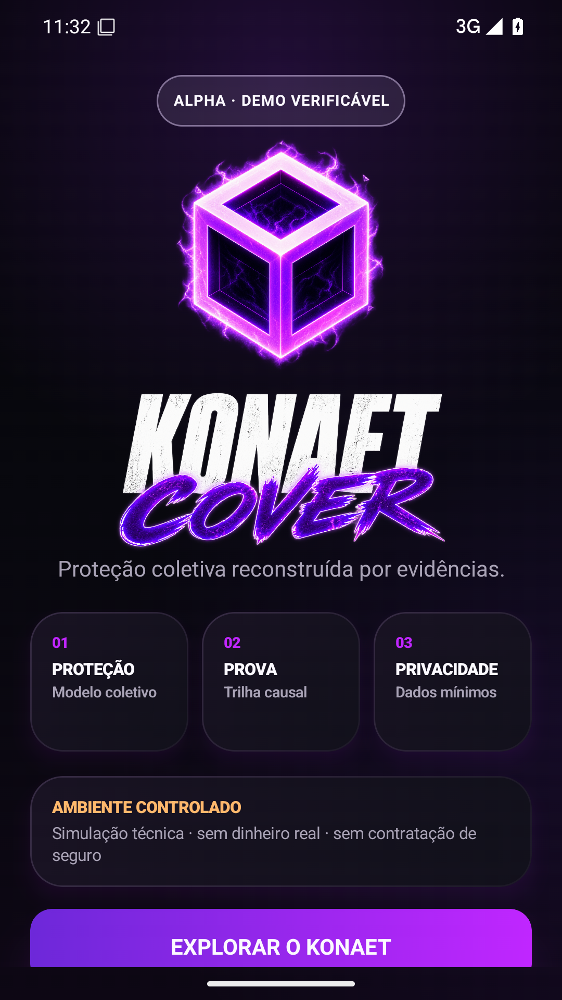
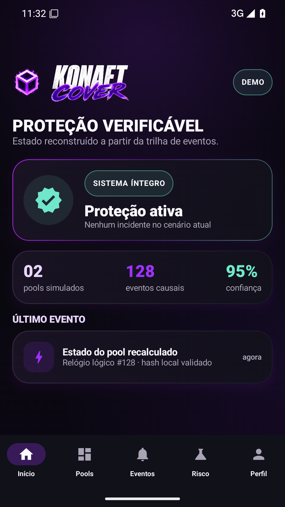
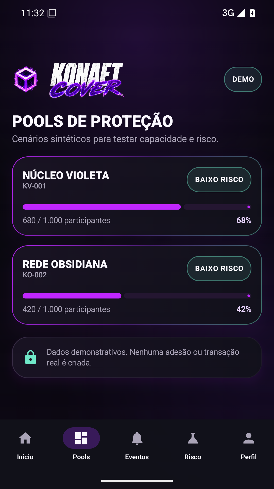
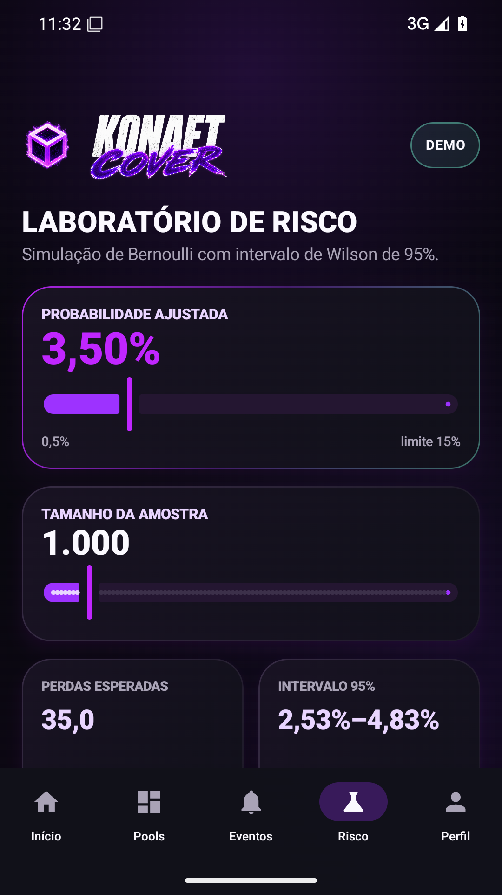
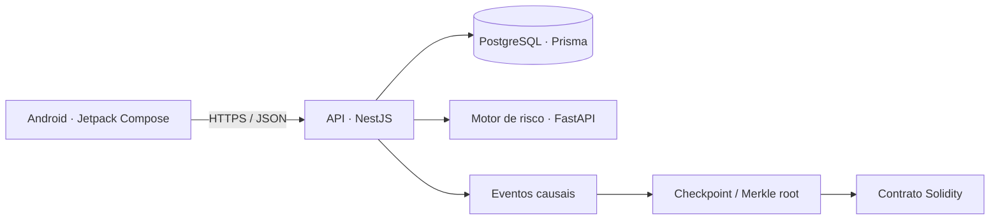

<div align="center">


# KONAET COVER

### Proteção experimental de dispositivos com decisões reconstruíveis

[](https://github.com/7dsolv/konaet-cover/actions/workflows/ci.yml)
[](https://github.com/7dsolv/konaet-cover/actions/workflows/android-smoke.yml)
[](https://github.com/7dsolv/konaet-cover/releases/tag/v0.1.0-alpha.2)
[](LICENSE)
[](CONTRIBUTING.md)
[](https://github.com/7dsolv/konaet-cover/issues)
[](https://github.com/7dsolv/konaet-cover/pulls)
[](#limites-e-segurança)

`Android` · `Kotlin` · `NestJS` · `TypeScript` · `FastAPI` · `Python` · `PostgreSQL` · `Solidity`

</div>

> [!IMPORTANT]
> O projeto está em **modo de demonstração e pesquisa**. Não movimenta dinheiro real, não oferece seguro e não deve ser usado para decisões financeiras, atuariais ou regulatórias.

## Visão geral

O Konaet Cover é uma plataforma experimental para estudar proteção coletiva de dispositivos. A proposta combina aplicativo Android, API, simulação de risco, trilha causal e checkpoints verificáveis sem colocar dados pessoais em blockchain.

O princípio central é simples: **uma decisão não deve apenas existir; ela deve poder ser reconstruída a partir de estado, evento, evidência e regra**.

## Android alpha

A versão `0.1.0-alpha.2` é uma demonstração navegável em Kotlin e Jetpack Compose, com identidade visual própria, laboratório de risco interativo e fluxo completo em português. Ela pode ser usada sem servidor pelo botão **Entrar no modo demonstração**.

[**Baixar o APK de demonstração**](https://github.com/7dsolv/konaet-cover/releases/tag/v0.1.0-alpha.2)

<div align="center">
  
  
  
  
</div>

O APK público usa a chave de debug do Android e serve somente para instalação e testes. Para a Play Store, o arquivo correto é o `prodRelease.aab` assinado em ambiente seguro com uma chave de upload própria. Consulte as [instruções Android](apps/android/README.md), a [política de privacidade](docs/PRIVACY.md) e o [checklist da Google Play](docs/PLAY_STORE_CHECKLIST.md).

## Arquitetura



| Componente | Estado atual | Diretório |
|---|---|---|
| Aplicativo Android | Alpha compilável, com APK/AAB e validação automatizada | [`apps/android`](apps/android) |
| API | Módulos de autenticação demo, dispositivos, pools e sinistros | [`services/api`](services/api) |
| Motor de risco | Simulação Monte Carlo reproduzível e testada | [`services/risk-engine`](services/risk-engine) |
| Checkpoint on-chain | Contrato e testes Foundry | [`packages/contracts`](packages/contracts) |
| Infraestrutura local | PostgreSQL, Redis, MinIO e serviços | [`infra/docker`](infra/docker) |
| Painel administrativo | Planejado no roadmap | [`docs/ROADMAP.md`](docs/ROADMAP.md) |

## Modelo matemático demonstrativo

A probabilidade ajustada é limitada a 15% e combina fatores explícitos:

```math
p_{\mathrm{ajustada}} = \min\left(p_{\mathrm{fabricante}}\, f_{\mathrm{idade}}\, f_{\mathrm{cobertura}}\, f_{\mathrm{região}},\ 0{,}15\right)
```

Cada execução estima a frequência de perda em $N$ amostras de Bernoulli:

```math
\widehat{p} = \frac{1}{N}\sum_{i=1}^{N} X_i, \qquad X_i \sim \mathrm{Bernoulli}\!\left(p_{\mathrm{ajustada}}\right)
```

O resultado inclui um intervalo de confiança de 95% pelo método de Wilson. Uma semente opcional permite reproduzir a mesma simulação em testes e auditorias.

> Os coeficientes atuais são sintéticos. Antes de qualquer uso real, o modelo precisaria de dados autorizados, validação atuarial, análise de viés e revisão regulatória.

## Início rápido

### Requisitos

- Node.js 22+ (24 LTS recomendado)
- Corepack e pnpm 10
- Python 3.12+
- Docker com Compose
- JDK 17 e Android SDK 36 para o aplicativo
- Foundry para os contratos

### API e infraestrutura

```bash
corepack pnpm install
docker compose -f infra/docker/docker-compose.yml up -d
corepack pnpm run db:generate
corepack pnpm run db:push
corepack pnpm run db:seed
corepack pnpm run dev:api
```

Copie `.env.example` para `.env` e use apenas credenciais locais. Arquivos `.env*` reais são ignorados pelo Git.

### Motor de risco

```bash
python -m venv .venv
source .venv/bin/activate # Linux/macOS
# PowerShell: .\.venv\Scripts\Activate.ps1
python -m pip install -r services/risk-engine/requirements.txt
python services/risk-engine/main.py
```

Documentação interativa: `http://localhost:8888/docs`.

Exemplo reproduzível:

```bash
curl -X POST "http://localhost:8888/v1/assess-device?simulations=10000&seed=7" \
  -H "Content-Type: application/json" \
  -d '{
    "device_id": "demo-001",
    "make": "Samsung",
    "model": "Demo Phone",
    "age_days": 120,
    "purchase_value_minor": 350000,
    "coverage_days": 365
  }'
```

## Verificação

```bash
corepack pnpm run build
corepack pnpm run lint
corepack pnpm run format:check
corepack pnpm run test:api
corepack pnpm run test:risk
corepack pnpm run test:contracts

cd apps/android
./gradlew test lintDevDebug assembleDevDebug bundleProdRelease
```

O workflow de CI executa verificações independentes para API, motor de risco, contrato e Android. No Android, ele valida o Gradle Wrapper, roda testes e lint, compila o APK `devDebug` e o AAB `prodRelease`. Um workflow manual adicional instala o APK em um emulador Android 15, abre a atividade principal e publica uma captura de tela como evidência.

## Como colaborar

Forks, issues e pull requests são bem-vindos. Antes de começar:

1. leia o [guia de contribuição](CONTRIBUTING.md);
2. escolha uma issue com o selo `good first issue` ou proponha uma melhoria;
3. mantenha o modo `DEMO/SIMULATION` e não adicione dados pessoais ou segredos;
4. inclua testes e explique as decisões técnicas no pull request.

Consulte também o [código de conduta](CODE_OF_CONDUCT.md), a [política de segurança](SECURITY.md), a [política de privacidade](docs/PRIVACY.md) e o [roadmap](docs/ROADMAP.md).

## Limites e segurança

- Sem liquidação ou dinheiro real.
- Sem IMEI/IMSI e sem dados pessoais em blockchain.
- IA não aprova ou rejeita solicitações sozinha.
- Chaves, tokens e credenciais nunca entram no Git.
- O contrato é experimental e não foi auditado externamente.
- O modelo de risco não é uma recomendação financeira nem atuarial.

Relate vulnerabilidades pelos [advisories privados do GitHub](https://github.com/7dsolv/konaet-cover/security/advisories/new), sem abrir issue pública.

## Licença

Distribuído sob a [licença MIT](LICENSE). Você pode estudar, modificar e criar forks, preservando o aviso de copyright.

---

<div align="center">

Construído por [Adilson Oliveira · @7dsolv](https://github.com/7dsolv)

</div>
